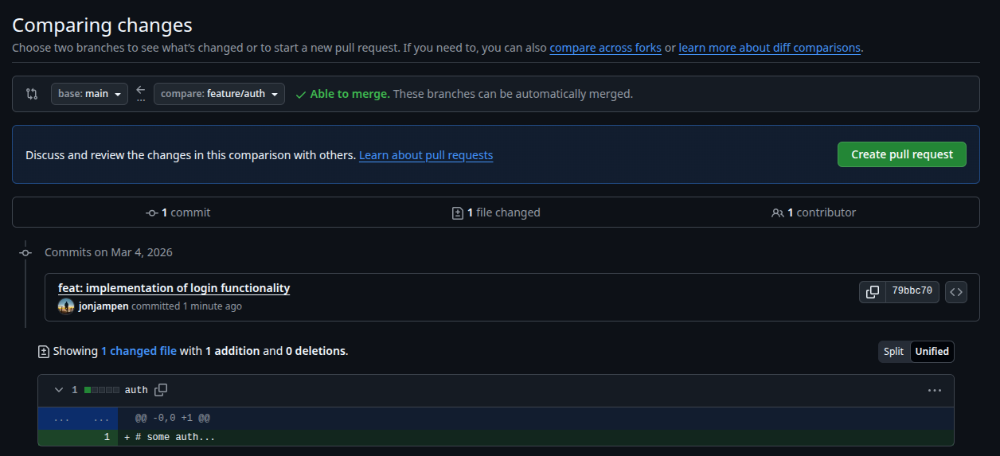
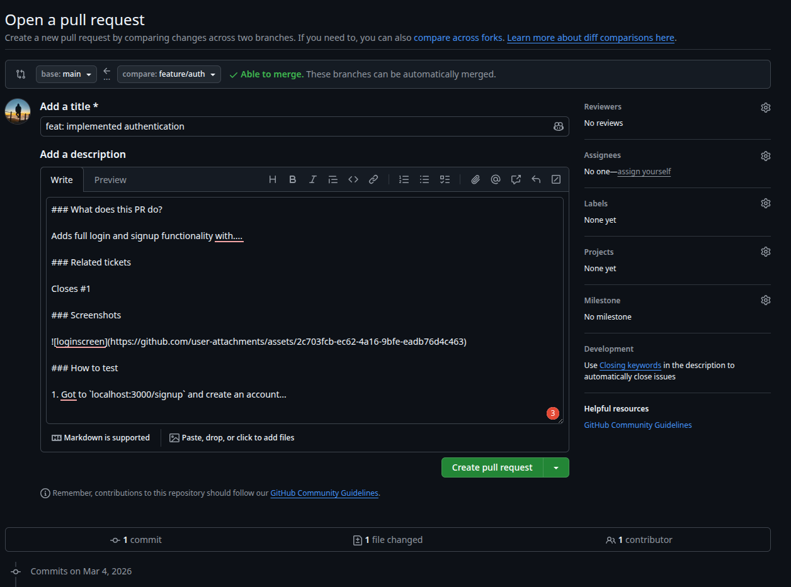

# Git Workflow

## Feature Branch: Neues Feature implementieren

Neuer Git-Branch erstellen. Branch-Name beginnt mit `feature/*` oder `fix/*`:

```
git checkout -b feature/auth
```

Nach jeder Änderung zu diesem Feature einen Commit erstellen (Commit-Message beginnt mit `feat:`, `bugfix:`, `refactor:`, `docs:`, oder `style:`; vgl [convention](https://www.conventionalcommits.org/en/v1.0.0/)):

```
git add .
git commit -m "feat: implementation of login functionality"
git push --set-upstream origin feature/auth      # nur das erste Mal, danach einfach: git push
```

## Pull-Request erstellen

### Rebase

Sobald das ganze Feature implementiert wurde:

```
git checkout main
git pull
git checkout feature/auth
git rebase main
# Falls Konflikte auftreten: Lösen und 'git rebase --continue'
git push --force-with-lease
```

### Pull-Request

Gehe auf: https://github.com/Garaio-REM/provisionary/pulls und erstelle einen neuen Pull-Request. Wähle den Feature-Branch als `compare:` und klicke `Create pull request`.



Wähle einen passenden **Titel** (Struktur ähnlich wie bei Git-Commits). Copy-Paste folgendes in die **Description** und ersetze die Klammern. Bei Related tickets kann die Issue-Nummer zusammen mit einem Keyword (`closes` oder `fixes`) verwendet werden (z.B. `Closes #1`), um den Pull-Request mit dem Issue zu verlinken. Somit wird der Issue auch automatisch als abgeschlossen markiert, sobald der PR gemerged wird. Wähle einen **Reviewer** aus und klicke anschliessend auf `Create pull request`.

```
### What does this PR do?

(describe the changes here)

### Related tickets

(link any related issues or past PRs here)

### Screenshots

(if applicable, add screenshots here)

### How to test

(steps for testing the changes)

### Additional notes

(any other information, optional)

```



## Pull-Request review & merge

Die als Reviewer markierte Person kann dann mit dem GitHub CLI den Pull-Request lokal testen: `gh pr checkout [PR-Nummer]` und auf GitHub unter `Files Changed` eine Review erstellen. Um verbesserungen zum PR hinzuzufügen, können diese einfach auf den Feature-Branch gepushed werden. Falls alles funktioniert, nochmals überprüfen, dass alle änderungen aus `main` gemerged wurden und dass alle Tests passen. Falls inzwischen änderungen an `main` gemacht wurden, muss der Rebase oben wiederholt werden.

Wähle `Merge pull request` (**Create a merge commit**) aus.
